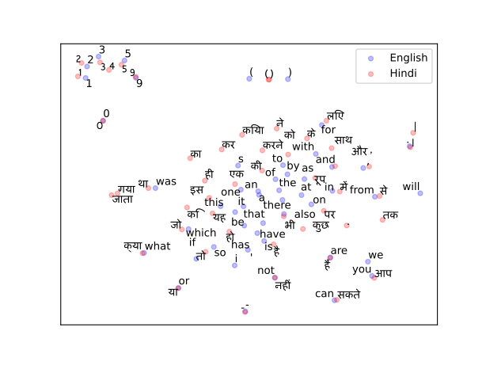

## Challenge Overview
The Machine Translation Competition of CS779 was about developing models to translate text between English and seven Indian Languages. The seven Indian Languages were Bengali, Gujarati, Hindi, Kannada, Malayalam, Tamil and Telugu, which are among the most popular languages spoken across India. The first phase was on translating from English to Indian Languages, while the second phase required the reverse. The dataset was a corpus from [AI4Bharat](https://ai4bharat.iitm.ac.in/) which consisted of pairs of sentences in the source and the target language.

There were certain constrains in place to enhance the learning. PyTorch had to be utilised for implementation and higher level libraries were not permitted. Apart from word embeddings, no pre-trained components (e.g. tokenisers) were not allowed. In the first phase, participants were allowed to use separate models for each language pair, but for the second phase, the participants were supposed to develop a single model for translating from all seven Indian Languages to English.

## Phase 1
For the first phase, I worked on developing my own model for the task of translation. It was based on the idea of bringing the word representations of two different languages to a common vector-space. To further improve the performance of this model I additionally experimented with enhancements such as TF-IDF, pre-trained word embeddings and a word order corrector. I also experimented with elementary neural models like RNNs.

   
  English and Hindi - Common Vector Space

## Phase 2
For the second phase, I experimented with more powerful neural models like GRUs, LSTMs and Tranformers. Utilisiation of effective post-processing methodologies including case restoration and numerical processing helped in boosting the performance of the models. As a part of this phase I ranked second.

## Results

| **Phase** | **Rank** | **BLEU** | **ROUGE** | **chrF++** |
|-------|------|------|-------|--------|
| 1     | 10   | 4.7  | 29.7  | 31.8   |
| 2     | 2    | 17.0 | 45.4  | 43.9   |